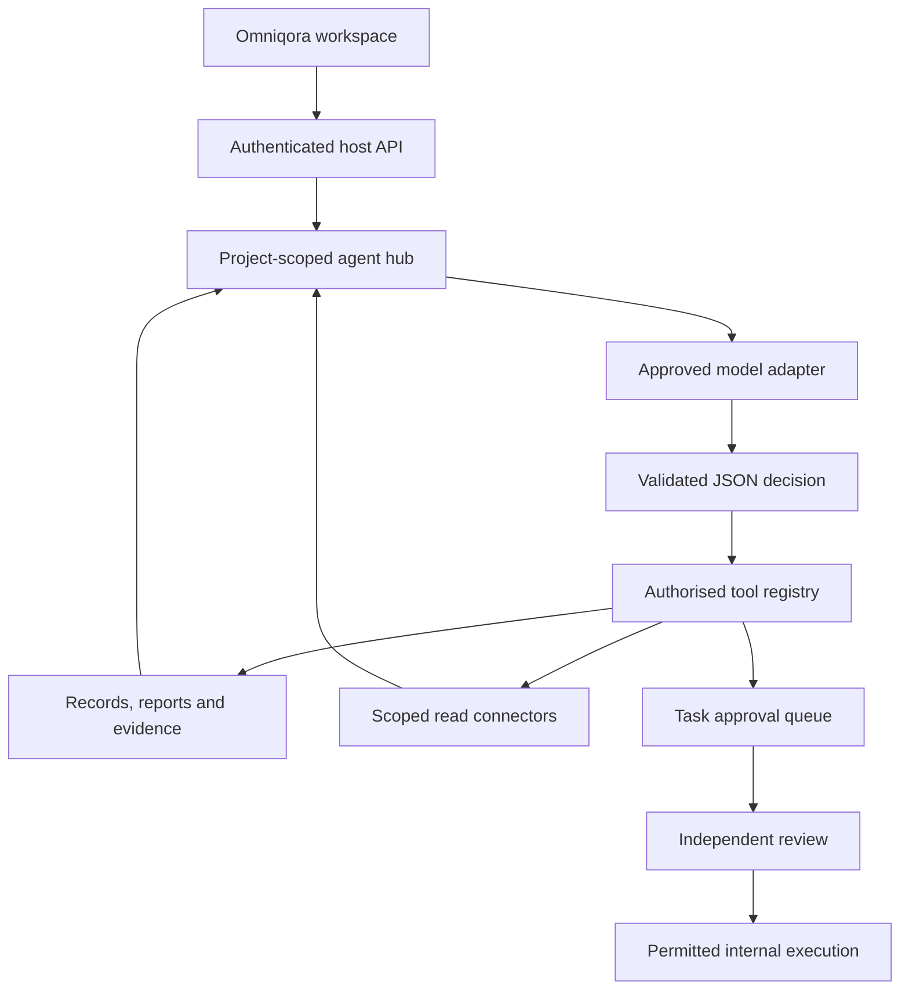

# Model providers, tools, agents and connectors — version 0.3.0

The next layer is implemented as an **AI & connectors** workspace and a server-side agent hub. The hub uses the existing identity, tenant/project membership, evidence store, planning engine, financial calculations and approval queue. It does not require replacing the company-planning application.

The delivery sequence is: configure one approved model, bind it to one project, enable owner-approved data sharing, run a specialist against existing records, connect one read-only source, then validate the results with its business owner. Expand integrations after that pilot passes. Start with whichever model account and hosting boundary the customer already approves; no particular model ID or subscription is assumed.

## What this version implements

| Layer | Included |
| --- | --- |
| Provider adapters | OpenAI Responses, Azure OpenAI Responses, Anthropic Messages, Gemini generateContent, Bedrock Converse and Ollama chat. All return a parsed JSON decision through one internal interface. |
| Model routing | Owner-selected model per discovery, finance, technical, compliance, product or transaction specialist. Only operator-configured connections bound to the exact tenant and project are selectable. |
| Agent runtime | Persisted runs; one model step per API request; run-to-result UI up to the configured limit; observations, references, usage, errors, history, cancellation and restart-safe continuation. |
| Tools | Scoped record reads, deterministic financial/technical/product/workstream reports, company-plan preview, retrieval-only evidence search, approved connector reads and task proposals. |
| Connectors | Microsoft Graph application/organisation/licence metadata; one configured GitHub repository/open issues; a projected JSON inventory feed at an exact approved endpoint. |
| Controls | Default off; owner-approved data sharing; project/tenant call limits; output-token and step caps; atomic step claiming; stale-input rejection; permission rechecks; pause/cancel; independent task approval. |
| Workspace | Provider catalogue, model routes, policy controls, goals, one-step or bounded run-to-result execution, run history, observation/usage inspection, connector preview and explicit evidence ingestion. |

This is a development implementation. API contract fixtures and local integration tests passed. No real model, cloud, Microsoft tenant, GitHub customer repository or ERP system was contacted during verification.

## Architecture



The model selects a tool or returns a cited draft. The application validates the response and performs the operation using the authenticated actor and project. Models never receive signing keys, provider credentials or arbitrary network/SQL/shell access. All tool arguments are checked server-side. Each specialist has a fixed allowlist; finance-role users can run only the finance specialist and cannot propose tasks through it.

The new loop uses a **provider-neutral JSON decision protocol**, not native provider function-call streaming. Every step sends the goal, permitted tool descriptions and saved observations. OpenAI/Azure, Gemini and Ollama request JSON output; Anthropic/Bedrock receive a JSON instruction and their result is strictly parsed. Refused, truncated, malformed and unauthorised responses stop the run. There is no automatic cross-provider retry or fallback that could silently change the data destination or create another charge.

## 1. Choose the model and credentials

| Provider | Server setup | Credential handling |
| --- | --- | --- |
| OpenAI | Approved model ID and API account with access to Responses/JSON mode | Named `OQ_SECRET_...` environment reference, injected through your secret manager |
| Azure OpenAI | Resource origin plus deployment name; Responses support must be verified for that deployment | Resource API key in a named environment reference; Entra token-refresh adapter is additional work |
| Anthropic | Approved Claude model ID and API account | API key in a named environment reference |
| Gemini | Approved model supporting generateContent JSON responses | API key in a named environment reference, sent in a header |
| Bedrock | AWS region and authorised model/inference-profile ID; optional named AWS profile | AWS SDK credential chain/profile; use an appropriately scoped runtime role |
| Ollama / supported installed Llama models | Operator-managed server and installed JSON-capable model name | Optional bearer credential; loopback HTTP or approved remote HTTPS |

Keep the model identifier explicit. Provider availability, model permissions, deployment names, context windows and billing differ by account. The package does not guess which model the account can use or download a model automatically. Smaller output limits may be insufficient for reasoning models; incomplete responses are rejected.

Only Bedrock requires an additional Python dependency:

```bash
python3 -m pip install -r requirements-ai.txt
```

Resolve and lock the SDK version used in the actual deployment. The other adapters use Python's standard-library HTTP client. Existing Ollama embeddings remain available in the legacy knowledge service; this version does not add embedding adapters for the five hosted providers.

## 2. Bind the configuration to a project

Create the project through the normal authenticated application first. Record its real tenant and project IDs. Copy `services/transformation/ai-config.example.json` to an operator-owned configuration file outside the repository. Keep only the entries you intend to use and replace every placeholder.

For a first pilot, a small configuration is enough:

```json
{
  "tenant_daily_model_calls": 100,
  "models": [
    {
      "id": "approved-model",
      "label": "Approved project model",
      "provider": "openai",
      "model": "YOUR_APPROVED_MODEL_ID",
      "credential_env": "OQ_SECRET_PROJECT_MODEL",
      "bindings": [{"tenant": "REAL_TENANT_ID", "project": "REAL_PROJECT_ID"}]
    }
  ],
  "connectors": []
}
```

Set `OQ_AI_CONFIG` to the absolute path and inject `OQ_SECRET_PROJECT_MODEL` through the deployment's secret manager. Restart the service after changing the configuration. There is no browser form for raw provider keys or URLs. Registry changes invalidate older agent runs. Bindings require exact IDs; wildcard tenants and arbitrary caller-supplied endpoints are unsupported.

The configuration file contains credential references, not key values. The API returns labels, IDs, provider/model names and permitted connector operations; it does not return those credential references or configuration endpoints. Bedrock profiles and remote Ollama deployments must be checked against the customer's actual data boundary.

## 3. Enable and run one specialist

Open **AI & connectors** as the project owner:

1. Select a configured model for the required specialist.
2. Set the step limit, output-token cap and daily call limits.
3. Approve sending the project's authorised records and retrieved evidence to the selected services, enable the hub, and save.
4. Choose the specialist and enter a focused goal.
5. Create the run, then use **Run next step** or **Run to result**.
6. Inspect observations, source references, uncertainties and proposed actions. Review proposals through the existing **Agents** queue.

Suggested pilot goals:

- Discovery: “Review the company and asset inventory. Identify missing facts needed for Day 1.”
- Finance: “Compare the entered current, target and transition costs. Identify assumptions that prevent a reliable budget.”
- Technical: “Use the dependency and readiness reports to explain the main cutover blockers.”
- Compliance: “Identify controls with missing applicability, version or acceptance evidence.”
- Product: “Review research, priorities and UAT to identify gaps before the next release.”
- Transaction: “Review our planning scope, diligence findings and TSA obligations before the sponsor meeting.”

The same provider can handle several profiles, or each profile can use a different approved model. There is no special model training implied by a specialist name. These are configured instructions plus different permitted tools.

Runs bind to the project input version, AI policy revision and operator registry digest. Changed data, permissions or configuration prevent further steps. An in-flight response is checked again before any tool effect or return. The run initiator can advance it; an owner or the initiator can cancel it. Cancellation cannot recall a request already sent to a provider. A process crash while a step is running leaves an uncertain running step: inspect and cancel it rather than automatically repeating a potentially charged request.

The browser's run-to-result action advances at most eight steps. Closing/navigating away stops further client-driven steps after the current request. A continuously operating background queue/worker, scheduled agents and coordinated multi-agent delegation are future deployment extensions; the durable step APIs provide their starting point.

## 4. Add source connectors

| Connector | Current read operations | Customer setup |
| --- | --- | --- |
| Microsoft Graph | Applications with projected ID/name fields; organisation metadata; subscribed licence metadata | Approved application/token with permissions for the selected operation, administrator consent where applicable and an operator-managed token refresh mechanism |
| GitHub | Metadata for one configured repository and the first page of open issues, excluding pull requests | Fixed owner/repository and an appropriately scoped installation/access token for private resources |
| JSON feed | First 25 objects from a list or `items` array, limited to configured field names | Exact HTTPS endpoint and optional bearer credential; a customer-controlled exporter can expose approved ERP/CMDB/inventory fields in this format |

Each connector has the same exact tenant/project binding as a model. The owner must additionally enable it in the project's AI policy. The source account's own permissions still apply. Verify the source account and returned company perimeter before relying on a connector; a valid token is not proof that it points at the right organisation.

Reads produce saved, dated snapshots. **Read connector** shows the data before ingestion. **Add reviewed snapshot to evidence** explicitly imports it into the existing knowledge store with a document ID and expected revision. Ingestion invalidates older plans/runs through the normal project version mechanism. It does not automatically create assets, infer relationships, approve completeness or write to the source system.

These are bounded first-page reads. `has_more` indicates additional or possibly additional results; it does not fetch arbitrary pagination URLs. They are not continuous or complete synchronisation engines. Microsoft access-token renewal, GitHub App installation flows, incremental cursors, deletions, source ACL inheritance, detailed ERP mappings and bulk discovery require their own implementation. Every project member can read that project's imported evidence; choose the project boundary accordingly.

The JSON connector accepts only an exact configured endpoint and a fixed field projection. Models and browser users cannot supply URLs, headers, credentials, filters or HTTP methods. It is suitable for a deliberately scoped read feed, not an unrestricted API client. Its endpoint must genuinely implement read semantics.

## 5. Add another tool or connector

A new **internal tool** needs a named implementation, input validation, a profile allowlist entry, project/role enforcement and negative tests. Keep calculations in deterministic code. A model-generated description or tool name does not grant authority.

A new **read connector** needs an operator configuration schema, authentication strategy, fixed operations, bounded pagination, field mapping, source provenance and tests for wrong-project access, unexpected responses and token failure. Reuse the connector snapshot/explicit-ingest path.

A new **external write action** needs a dedicated proposal type and independent review path, exact target/payload, dry-run output, idempotency key, current permission checks, execution status, reconciliation and a recovery procedure. A completed report or internal task must never imply that an ERP migration or cloud change happened. Current specialist agents have no approve, execute, payments, messaging, arbitrary code or infrastructure mutation tool.

MCP/A2A protocol clients, remote agent servers and native provider tool calling are not included in this version. Do not simply expose every tool a remote server advertises. A future adapter must verify server identity, bind its scope, review each permitted operation and route effects through the same action controls. A remote `readOnly` hint is not sufficient proof that an operation is safe.

## API contract

The new commands use the existing signed `POST /rpc` envelope. Browser clients call the authenticated TanStack server function; its Supabase check establishes the actor and tenant. Other SaaS backends can use the supplied server caller after implementing equivalent verified identity and tenant checks. Never give the signing key to a browser or expose a public endpoint that accepts caller-asserted identities.

| Command | Data | Behaviour |
| --- | --- | --- |
| `ai.status` | `{}` | Bound model/connector catalogue, policy revision and today's hub usage |
| `ai.policy.save` | `policy`, `expected_revision` | Owner-only policy update; optimistic revision check |
| `ai.runs.start` | `id`, `profile`, `goal` | Creates an idempotent run; no model call yet |
| `ai.runs.step` | Run `id` | Claims and performs one model step, then persists its result |
| `ai.runs.get` | Run `id` | Run state, observations, claims, uncertainties and stale indicator |
| `ai.runs.list` | `{}` | Latest 50 project runs |
| `ai.runs.cancel` | Run `id` | Initiator/owner cancellation; does not undo an already completed request |
| `connectors.read` | `connection_id`, `operation` | Scoped read preview and saved snapshot |
| `connectors.ingest` | `snapshot_id`, `document_id`, `expected_revision` | Explicitly import the reviewed snapshot as evidence |

The complete policy contains `enabled`, `data_sharing_approved`, `routes`, `connectors`, `max_steps`, `max_output_tokens`, `daily_model_calls` and `daily_connector_calls`. Profiles are `discovery`, `finance`, `technical`, `compliance`, `product`, `transaction`. Start IDs should be unique UUIDs; repeat a start request with the same ID/profile/goal only when checking an uncertain response.

## Usage and operational limits

The hub reserves each model attempt before the request, including failed/uncertain attempts. SQLite transactions enforce project and tenant daily call limits and prevent concurrent advancement of the same run. It records reported input/output tokens for successful responses. It does not compute an authoritative invoice, include every provider-specific billed token category, enforce a monetary spend cap, or settle customer billing. Apply account-level billing limits and reconcile provider invoices before charging tenants for usage.

Payloads, responses, record pages, connector pages and step counts are bounded. HTTP socket timeouts are configured; these are not full distributed job deadlines. The host caller allows 60 seconds per RPC. Use a production WSGI server with appropriate concurrency and timeouts, and a worker/queue for unattended operation. The bundled developer server is single-threaded, so cancellation/pause requests may wait behind an in-flight request there.

Agent source-reference validation establishes that a cited observation exists. It does **not** establish that the generated claim correctly interprets the observation. Final outputs remain drafts. Semantic evaluation, finance/domain review, data residency/retention decisions and customer-specific integration acceptance remain necessary.

The older **Evidence/Product** direct-generation path retains its existing `KNOWLEDGE_PROVIDER` configuration and is separate from these hub quotas and routes. It defaults to retrieval only; retain that default when piloting the new hub to avoid an unmetered legacy generation path. Agents use retrieval-only knowledge queries internally, so an agent evidence search cannot trigger a hidden second generation call.

## Provider and connector references checked

- [OpenAI Responses structured outputs](https://developers.openai.com/api/docs/guides/structured-outputs)
- [Azure OpenAI Responses API](https://learn.microsoft.com/en-us/azure/foundry/openai/how-to/responses?view=foundry-classic)
- [Anthropic tool and Messages request examples](https://platform.claude.com/docs/en/agents-and-tools/tool-use/define-tools)
- [Gemini generateContent API](https://ai.google.dev/api/generate-content)
- [Bedrock Converse API](https://docs.aws.amazon.com/bedrock/latest/APIReference/API_runtime_Converse.html)
- [Ollama chat API](https://docs.ollama.com/api/chat)
- [Microsoft Graph application inventory](https://learn.microsoft.com/en-us/graph/api/application-list?view=graph-rest-1.0)
- [GitHub repository REST API](https://docs.github.com/en/rest/repos/repos)

References informed adapter shapes; live compatibility with the selected account/model must be checked during activation. No pricing or model availability is inferred from these links.
