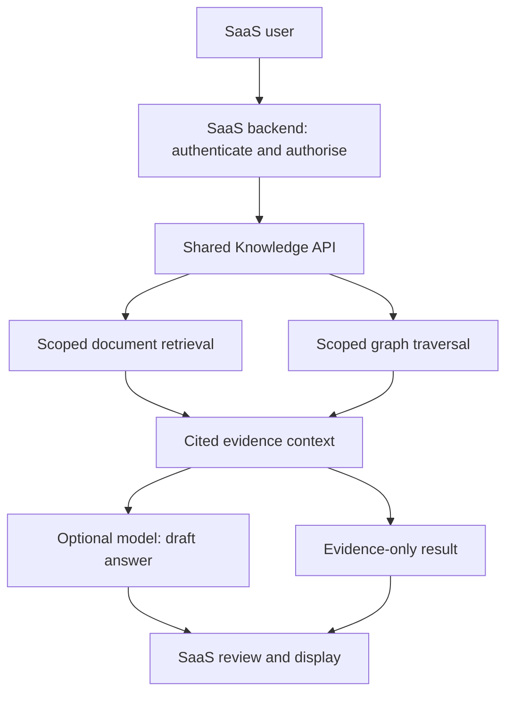

# One engine, small application adapters

The reusable product is an internal knowledge service that can later be administered through Omniqora. Each SaaS stays responsible for deciding what a user may see and what business actions are permitted.

The same Python logic runs for all projects. Reuse does not mean sharing private customer records between projects. Credentials bind a caller to a project, tenant and exact allowed collections. A request cannot override its tenant or project.

Version 0.2 adds an optional Neo4j backend. In that mode documents, chunks, entities, relationships and traces live in Neo4j, and the service uses Cypher for graph path queries. Source changes and derived-link invalidation share one database transaction. SQLite remains the default alternative; there is no dual-write synchronization between databases. Switching backend requires ingesting the intended sources into the selected database.

All Neo4j entity keys include the full project/customer/collection scope. Native path queries constrain every node and relationship to that scope and to source chunks eligible under the query's date, language and jurisdiction filters. Parameters are supplied as data, not interpolated into Cypher. A scope-level lock makes source snapshots consistent with adapter updates; this serializes the short database work in a collection and should be load-tested before larger deployments. Model generation runs after that transaction ends.

## Shared core and application work

| Core capability | Per-application responsibility |
| --- | --- |
| Text indexing, retrieval and citations | Select and normalise allowed source documents; retain source identifiers |
| Generic edges and bounded traversal | Define entity identities/relations and verify the supporting claims |
| Scope enforcement | Authenticate the user; verify current tenant, role, collection and case membership |
| Model boundary and output validation | Supply domain rules and decide who must approve the answer |
| Trace/evaluation primitives | Create domain-specific expected questions and acceptance criteria |
| Read-only query API | Add the interface and integrate resulting drafts into the product flow |

Connectors can be small for straightforward document Q&A. Lawquo jurisdiction rules, changing legal sources, restricted cases, or operational record relationships need substantive domain work; a prompt change alone is not sufficient.

## Retrieval pipeline

1. The SaaS adapter authenticates the person, checks collection access and chooses its scoped service credential.
2. The service validates input and derives the project and tenant from that credential.
3. Retrieval filters sources by collection, language, validity interval and requested jurisdiction before ranking or graph traversal.
4. BM25 ranks matching passages. Optional embedding similarity is fused with BM25 using reciprocal rank fusion. Similarity scores are not confidence probabilities.
5. Graph mode starts from exact entity labels in the question or explicit seeds, traverses at most three edges deep and returns at most 24 paths. Edges preserve their asserted direction; traversal can follow a connection in either direction to find evidence. It does not infer causation or legal authority.
6. The service includes each selected path's supporting passages within a maximum of eight evidence chunks. Paths requiring evidence outside that budget are omitted.
7. Evidence mode returns actual source excerpts. Model mode asks for structured claims and validates their citation IDs. Every generated result remains a draft.
8. Identifiers, selected path IDs, timings and usage are saved as a scoped trace. Raw question/answer/source text is not persisted in traces. Traces are pruned after seven days on subsequent queries and purged for that collection on document updates/deletes.

Validity dates are provided by a trusted source adapter. They are not discovered or verified automatically. `valid_until` is exclusive. Each document keeps its latest revision, so the date filter is not a complete historical archive. Store separately versioned source IDs if historical editions must remain searchable.

## Omniqora and existing Lawquo work

The earlier intended boundary remains: Omniqora coordinates work and prepares drafts; Lawquo owns case permissions, legal research/source checks, legal review, client publication, email intake and case tasks.

This package does not modify or replace `supabase/functions/_shared/lawquo-omniqora.ts`. Keep that component in Lawquo. The previously discussed Omniqora event/task-outbox interfaces require inspection against its actual backend before using them. This package does not assume those endpoints exist and does not call them.

For asynchronous document sync later, use a durable outbox in each SaaS with a stable source event ID, ordered revisions, retries and dead-letter handling. This package's duplicate-safe ingestion supports retrying identical payloads, but it does not include that job infrastructure. Keep graph updates ordered after the source document revision has been indexed.

## Deployable evolution

1. Local demonstration: current package and fictional sources.
2. Single-product pilot: connect Haccora authentication/document mapping and a real model; evaluate with reviewed procedures.
3. Second-product reuse: add TaxNuvia's document adapter and demonstrate the same engine with separate data.
4. Shared service: production hosting, indexed Postgres/pgvector or other storage, usage accounting and robust sync.
5. Graph expansion: measure whether Neo4j's bounded traversal adds value, tune indexes and capacity, and consider Microsoft's GraphRAG only if its additional extraction/summarization features are needed.

The host/storage/model/usage choices should be made from measured pilot volume. This version incurs no model API calls in evidence mode.
